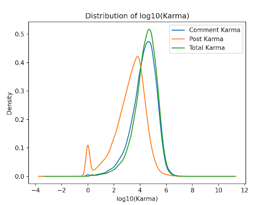

## Reddit Account Karma Analysis

Project by Uday Lingampalli

### So, what is Reddit?

Reddit is a social media website where users can post content
and news. These posts are made to subreddits, communities
of users centered around a specific topic, and users can
comment on other posts and comments.

### Comment/Post Scores

Reddit users can “upvote” or “downvote” posts and comments
(submissions), giving them a score (# of upvotes minus # of
downvotes), serving as a measure of others’ reaction to the
content they posted.

### Then, what is Karma?

Comment karma and Post karma: Sum of the scores of all a
user’s comments/posts, respectively
● (Well, not completely, the actual formula is more
complicated than that and unknown)
Total karma - Sum of a user’s comment and post karma

# What, then, can influence a Reddit user’s karma?

### Analysis introduction

To help explore this question, I collected the following data
from ~30,000 Reddit accounts:
● Year of account creation
● Comment karma, post karma, and total karma
● Their top 10 comments/posts by score, particularly:
    ○ Their content
    ○ Their scores
    ○ The date they were posted
    ○ The subreddit on which it was posted

# Data Collection

# Data Analysis

### Key Information - Summary

- The relative importance of comments over posts
- The unique combination of the sentiment and subreddit
    of a submission influences its score
- Submission trends over time - greater activity between
    2019–21, but less negative submissions relative to other
    sentiments during this time

# Karma Prediction Model

### Goal

Be able to predict a user’s karma without knowing their
comment, post, or total karma, or any features I created from
this information.

### A quick note on the R^2 Coefficient

- Measures how well a model can predict a dependent
    variable
- Ranges from -1.0 to 1.0 (-1.0 is worst, 1.0 is best)
- A _R_^2 coefficient of 0 - same as always predicting the
    dependent variable mean
- Positive value - better than always predicting the mean
- Negative value - worse than always predicting the mean

### Kept features

- (Slightly modified) Changed Account Creation Year
    feature to represent how long the account had existed
- Sum of the scores of top 10 submissions

### New Features

- SubSentAvg - consider count for Subreddits and
    Sentiments
- SubTotAvg - consider count for Subreddits
- dateSentAvg - consider count for Dates and Sentiments
- dateTotAvg - consider count for Dates
- scoreSentAvg - consider Scores, Dates, and Sentiment

### Purpose of New Features

- Can’t have a separate feature for score/sentiment/etc. for
    each of the 10 submissions - too many dimensions!
- Some data is qualitative - need to represent it in a
    meaningful quantitative way
- New features attempt to reduce dimensions while pulling
    useful numerical information from useful combinations
    of removed features

### Selecting a Model

- After testing out linear regression, decision tree
    regression, and Gaussian regression, I chose a k-NN
    regression algorithm as it yielded the best results (best _R_^2
    value)
- I believe this produced the best results due to the high
    variability of the predicted variable (hurts linear models),
    as well as similar accounts having similar features
- In the future, more features will be built with k-NN in
    mind, due to uniquely being suited to this situation

### k-NN Regression Model

- How it works:
    - Takes corresponding data of observation (Previous features)
    - Calculates distance to training data and selects the _k_ closest
       observations
    - Returns the average value of the dependent variable for those _k_
       observations
- Need to standardize features to same scale - all features
    have same weight in distance calculation

### Results

- Achieved a _R_^2 coefficient value of 0.27 on the full dataset
    (k=48 neighbors)
- Achieved a _R_^2 coefficient value of 0.37 when total karma
    was less than 100,000 (still ~75% of the full dataset)
- Suggests missing information needed to better predict
    total karma for high karma accounts

### Missing features?

The model yielded a decent R^2 coefficient, but it could’ve been
better. What could’ve improved it?
- Comprehensive analysis on all comments, instead of just top 10
    - Total # of comments
    - Consider time of day each submission was posted
    - Collect an even larger sample of users

### Conclusion

- Subreddits, dates, and sentiment influences the score of a
    submission
- Certain sentiments will have different scores on average
    based on subreddit
- Most activity between 2019-2021
- Features seem to predict low karma accounts better -
    missing features may improve accuracy if
    analyzed/included

### Future Work

In addition to including missing features (assuming
functionality to retrieve that information is implemented),
how could this be improved?
- My analysis shows baseline of most features and how
    they relate to each other
- k-NN is good model for prediction
- More complex studies to find out how features relate to
    each other in higher dimensions
- Potentially engineer new features using more complex
    relationships between features to improve model
